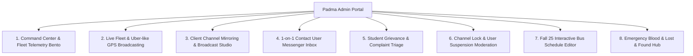

# 🛡️ Padma — Admin Portal & Transport Command Center

> Complete specification, architectural blueprint, and user manual for the **Padma Admin Portal & Fleet Command Center**.

---

## 1. Executive Summary & Access Credentials

The **Padma Admin Portal** provides university transit administrators and fleet supervisors with an AI-augmented, real-time command center to oversee daily bus fleet operations, broadcast emergency announcements, monitor GPS transponders, manage blood requests, and moderate student community channels.

### 🔑 Default Demo Administrator Credentials
- **Email / Username**: `admin@padma.com` (or `admin`)
- **Password**: `Padma@123`
- **Role**: `UserRole.admin`
- **Assigned Title**: *AUST Transport Directorate Administrator*

---

## 2. Core Feature Matrix

| Module | Core Functionality | UI Components & UX Paradigms |
| :--- | :--- | :--- |
| **Fleet & GPS Control** | Trip activation with Admin Identity selection (Person 1 to 6), GPS broadcasting permission prompt, Uber-like live map tracker. | Interactive fleet cards, broadcasting pulse, End Trip actions, live map telemetry. |
| **Command Center** | High-level fleet KPIs, active buses, on-time score, live dispatch log. | 3D Perspective Tilt Cards, Clean Bento Stats, Rapid Dispatch Studio. |
| **Channel Mirroring** | Full mirroring of Padma 1, Padma 2, Announcements, Rules & Regulations, Blood Requests, and Lost & Found. | Multi-channel navigation, admin-only announcement directive composer. |
| **Contact User Messenger** | 1-on-1 Direct Messaging with students, live autocomplete search (`User 1`, `User 11`, `User 12`...), thread history, and replies. | Messenger-style inbox split-view, quick reply composer, unread badges. |
| **Student Grievances** | Triage and manage submitted complaints with status lifecycle (Submitted, Under Review, Resolved, Dismissed). | Grievance triage cards, student metadata badges, resolution actions. |
| **Moderation & Security** | Channel lock switches for all channels, student suspension & unblock directory with search, message deletion. | Toggle switches, student directory list with search, delete message actions. |
| **Schedules & Timetable** | Edit 1st/2nd bus departure times, return trip hours, and per-stoppage ETAs synced to Supabase `route_stops`. | Interactive schedule table, edit hour dialogs, per-row ETA editor. |

---

## 3. UI/UX Innovations & Security Model

### 💎 1. 3D Spatial UI (`/3d-ui`)
- **Perspective Elevation**: Admin telemetry cards feature subtle 3D rotational tilt and dynamic light refraction borders on hover/tap.
- **Floating HUD Layers**: Telemetry stats float above darker background surfaces with multi-tiered z-axis elevation (`surfaceElevated` with soft ambient glow).

### 📍 2. Uber-like Live GPS Broadcasting & Permission Flow
- When an admin starts a trip, the app verifies the admin's identity (dropdown Person 1 to Person 6) and displays a realistic GPS broadcasting permission prompt.
- Upon authorization, high-frequency coordinates are streamed to Supabase `live_bus_locations` for real-time commuter map tracking.

### 🛡️ 3. Role-Based Moderation & Access Control
- Announcements and Rules & Regulations channels enforce admin-only messaging; students can view and react.
- Admins possess absolute deletion authority over any channel message; students may only edit their own submitted text.

- Floating quick-action dock for rapid emergency broadcasts.

---

## 4. Operational Workflows

### 4.1 Broadcasting a Live Emergency / Delay
1. Open **Admin Portal** → Select **Broadcast** tab.
2. Tap **✨ AI Draft** or select template (e.g. *Heavy Rain Route Diversion*).
3. Select priority level (**Urgent Alert** / **High Priority** / **Standard**).
4. Choose target route (**All Routes** or specific route like **Mirpur Line**).
5. Tap **Publish Broadcast** → Instantly mirrored to the app's `#announcements` channel and student alert feed.

### 4.2 Managing a Bus GPS Beacon
1. Navigate to **Fleet Control** tab.
2. Toggle **Live GPS Beacon** on Bus 1 (Mirpur Route).
3. Update status to `Delayed (+10m)` → The student map and upcoming stop cards immediately adjust ETA countdowns.
4. Contact driver directly using the integrated call shortcut.

### 4.3 Verifying an Emergency Blood Request
1. Open **Blood Moderation** tab.
2. Review patient details, hospital, and blood group requirements.
3. Tap **Verify & Boost** to send push notifications to matched verified student donors.
4. Once donor is found, mark as **Fulfilled**.

---

## 5. Security & Permission Architecture

- **Session Guard**: All admin routes and mutation controllers check `authVM.currentUser?.isAdmin == true`.
- **Audit Trail**: Every announcement and fleet status modification logs the administrative officer's ID and timestamp.
- **Fail-Safe Fallbacks**: If cellular connectivity is disrupted, the admin portal queues broadcast actions locally.
