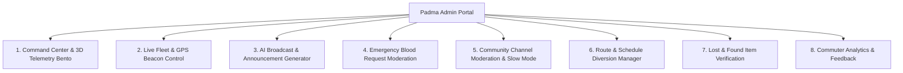

# 🛡️ Padma — Admin Portal & Transport Command Center

> Complete specification, architectural blueprint, and user manual for the **Padma Admin Portal & Fleet Command Center**.

---

## 1. Executive Summary & Access Credentials

The **Padma Admin Portal** provides university transit administrators and fleet supervisors with an AI-augmented, real-time command center to oversee daily bus fleet operations, broadcast emergency announcements, monitor GPS transponders, manage blood requests, and moderate student community channels.

### 🔑 Default Demo Administrator Credentials
- **Email / Username**: `admin@padma.com` (or `admin`)
- **Password**: `Padma@123`
- **Role**: `UserRole.admin`
- **Assigned Title**: *AUST Transport Directorate Administrator*

---

## 2. Core Feature Matrix

| Module | Core Functionality | UI Components & UX Paradigms |
| :--- | :--- | :--- |
| **Command Center** | High-level fleet KPIs, live commuter count, on-time percentage score, active beacons. | 3D Perspective Tilt Cards, Glassmorphic Stats, AI Anomaly Ticker. |
| **Fleet GPS Control** | Start/stop GPS broadcasting per bus, change status (On Time, Delayed, Breakdown), adjust speed. | Floating interactive bus fleet list with real-time controls and driver dialer. |
| **AI Announcement Studio** | Priority broadcasting with AI auto-drafting for delays, rain detours, and exam schedules. | AI Prompt modal, markdown preview, route targeting selector. |
| **Emergency Blood Hub** | Verify student emergency requests, mark as Fulfilled, filter urgent medical cases. | Red-accented cards, donor count matching, one-tap verification. |
| **Community Moderation** | Lock announcement channels, activate slow mode, review reported student messages. | Moderation queue, mute/ban student dialog, slow-mode slider. |
| **Route & Timetable Editor** | Manage departure schedules (7:15 AM, 1:45 PM, 4:30 PM), add temporary detour stops. | Timetable cards, detour builder, driver assignment. |
| **Lost & Found Hub** | Verify recovered student items (ID cards, calculators), log claims. | Item thumbnail cards, verification badges, status toggles. |
| **Analytics & Feedback** | Punctuality graphs, student ride ratings, crowd congestion heatmaps. | Visual performance indicators, feedback list with star ratings. |

---

## 3. UI/UX Innovations & Skills Applied

### 💎 1. 3D Spatial UI (`/3d-ui`)
- **Perspective Elevation**: Admin telemetry cards feature subtle 3D rotational tilt and dynamic light refraction borders on hover/tap.
- **Floating HUD Layers**: Telemetry stats float above darker background surfaces with multi-tiered z-axis elevation (`surfaceElevated` with soft ambient glow).

### 🤖 2. AI-Native Interface (`/ai-native-ui`)
- **AI Transit Copilot**:
  - Automatically identifies bottleneck points (e.g., *Mohakhali Flyover congestion*) and recommends specific schedule buffers.
  - Generates instant bilingual (English / Bengali) official transit announcements from simple keywords.
- **Predictive Fleet Balancing**: Proactively highlights passenger surges at key hubs (e.g. Agargaon Metro).

### 📐 3. Floating UI & Bento Grid (`/floating-ui`, `/ui-ux-pro-max`)
- Modular **Bento Grid** layout organizing high-density data without visual clutter.
- Floating quick-action dock for rapid emergency broadcasts.

---

## 4. Operational Workflows

### 4.1 Broadcasting a Live Emergency / Delay
1. Open **Admin Portal** → Select **Broadcast** tab.
2. Tap **✨ AI Draft** or select template (e.g. *Heavy Rain Route Diversion*).
3. Select priority level (**Urgent Alert** / **High Priority** / **Standard**).
4. Choose target route (**All Routes** or specific route like **Mirpur Line**).
5. Tap **Publish Broadcast** → Instantly mirrored to the app's `#announcements` channel and student alert feed.

### 4.2 Managing a Bus GPS Beacon
1. Navigate to **Fleet Control** tab.
2. Toggle **Live GPS Beacon** on Bus 1 (Mirpur Route).
3. Update status to `Delayed (+10m)` → The student map and upcoming stop cards immediately adjust ETA countdowns.
4. Contact driver directly using the integrated call shortcut.

### 4.3 Verifying an Emergency Blood Request
1. Open **Blood Moderation** tab.
2. Review patient details, hospital, and blood group requirements.
3. Tap **Verify & Boost** to send push notifications to matched verified student donors.
4. Once donor is found, mark as **Fulfilled**.

---

## 5. Security & Permission Architecture

- **Session Guard**: All admin routes and mutation controllers check `authVM.currentUser?.isAdmin == true`.
- **Audit Trail**: Every announcement and fleet status modification logs the administrative officer's ID and timestamp.
- **Fail-Safe Fallbacks**: If cellular connectivity is disrupted, the admin portal queues broadcast actions locally.
