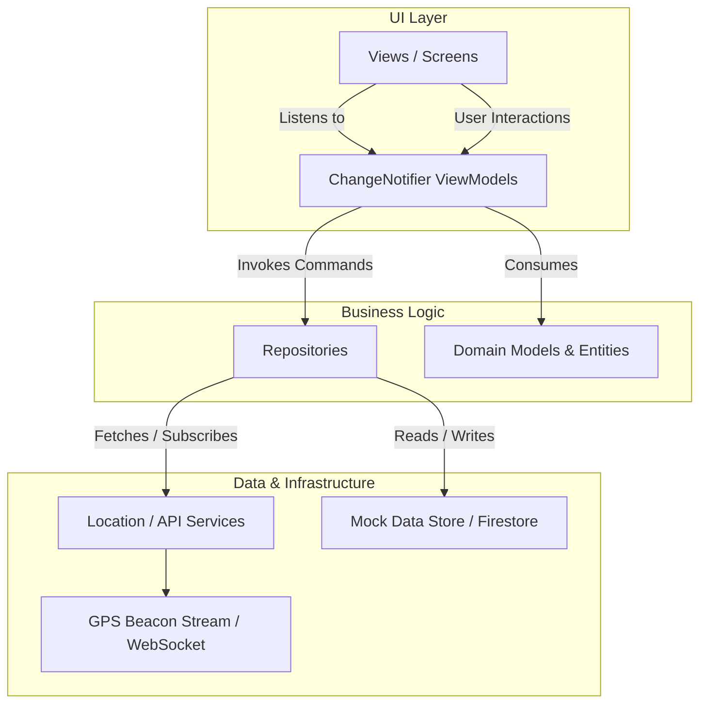
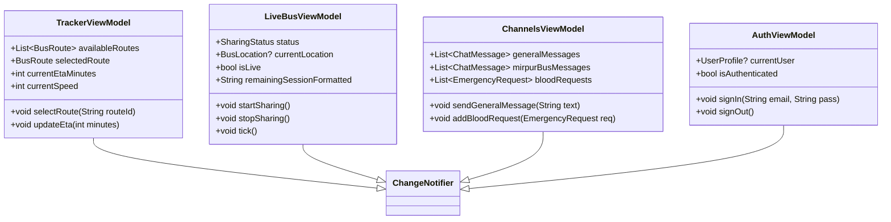
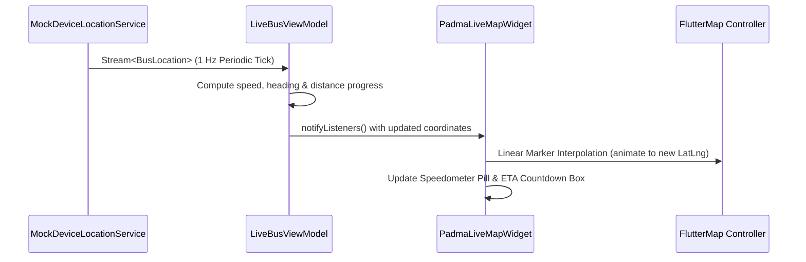

# 🏗️ Padma — Software Architecture & Technical Design

> Technical architecture, code organization, state management paradigms, and data flow pipelines for **Padma**.

---

## 1. Architectural Pattern: Clean MVVM

Padma is built on a decoupled, testable **Model-View-ViewModel (MVVM)** pattern with clear boundaries between UI, Domain Logic, and Data Ingestion:



---

## 2. Directory Structure

```
padma/
├── lib/
│   ├── main.dart                      # App entry point & MultiProvider initialization
│   │
│   ├── core/                          # 🌐 Core Infrastructure & Cross-Cutting Concerns
│   │   ├── config/                    # Global app configuration (Map bounds, zoom levels)
│   │   ├── l10n/                      # ARB localization files & generated classes
│   │   ├── theme/                     # AppTheme, AppColors, AppSpacing, typography
│   │   ├── utils/                     # Formatters, validators, date helpers
│   │   └── widgets/                   # Reusable UI components (NextStopCard, Badges, Chips)
│   │
│   ├── data/                          # 📦 Data Layer (Models, Repositories, Mock Data)
│   │   ├── mock/                      # Initial mock seeds for AUST buses, users, channels
│   │   ├── models/                    # Data transfer & domain entity classes
│   │   ├── repositories/              # Concrete data repositories (Auth, Transit, Chat, Emergency)
│   │   └── services/                  # GPS mock service & device stream providers
│   │
│   ├── features/                      # 🚀 Isolated Domain Modules
│   │   └── live_bus/                  # Live telemetry, GPS beacon simulation, and vector map screen
│   │       ├── data/                  # Mock GPS service & waypoint polylines
│   │       ├── domain/                # SharingStatus & BusLocation entity models
│   │       └── presentation/          # LiveBusViewModel, Map controls, LiveBusMapScreen
│   │
│   └── ui/                            # 🎨 Feature Presentation Modules
│       ├── core/                      # UI theme tokens & shared visual utilities
│       └── features/                  # App Views & ViewModels
│           ├── auth/                  # Sign In, Sign Up, Verification
│           ├── tracker/               # Live Transit Map, Route Switcher, Stop Timeline
│           ├── channels/              # Discord Drawer, General Chat, Telemetry Feeds, Requests
│           ├── profile/               # Student ID profile & donor preferences
│           ├── notifications/         # Real-time alerts feed & broadcast announcements
│           └── home/                  # Main shell Scaffold with bottom navigation
│
├── docs/                              # 📚 Comprehensive Documentation Suite
├── test/                              # 🧪 Unit, Widget, and Navigation Test Suite
└── pubspec.yaml                       # Dependencies & Flutter asset definitions
```

---

## 3. State Management: Provider & ViewModels

Padma utilizes Flutter's standard `Provider` / `ChangeNotifier` ecosystem for state propagation:



### MultiProvider Injection at Root (`lib/main.dart`):
```dart
MultiProvider(
  providers: [
    ChangeNotifierProvider(create: (_) => AuthViewModel()),
    ChangeNotifierProvider(create: (_) => TrackerViewModel()),
    ChangeNotifierProvider(create: (_) => LiveBusViewModel()),
    ChangeNotifierProvider(create: (_) => ChannelsViewModel()),
  ],
  child: const PadmaApp(),
)
```

---

## 4. Real-Time Telemetry Pipeline



### Map Layer Stack:
1. **Base Raster Layer**: CartoDB Dark Matter tiles via `TileLayer` (`https://basemaps.cartocdn.com/rastertiles/dark_all/{z}/{x}/{y}@2x.png`).
2. **Route Polyline Layer**: Fixed coordinates connecting AUST campus to route terminals (Mirpur, Uttara, Motijheel).
3. **Animated Bus Marker Layer**: Live pulsing GPS dot with heading rotation and bus icon.
4. **Stops & Checkpoints Layer**: Interactive stop nodes with ETA labels and arrival progress.

---

## 5. Security & Permission Architecture

| Layer | Policy | Enforcement |
| :--- | :--- | :--- |
| **Authentication** | Student email verification (e.g. `@aust.edu`). | `AuthRepository` session guard |
| **Channel Write Access** | `#announcements` write-locked to Admin; `#general` open to all verified riders. | `ChannelDrawer` and message composer guard |
| **GPS Beacon Control** | Only authorized drivers or demo controllers can broadcast GPS coordinates. | `DemoControlPanel` / `SharingStatus` state check |
