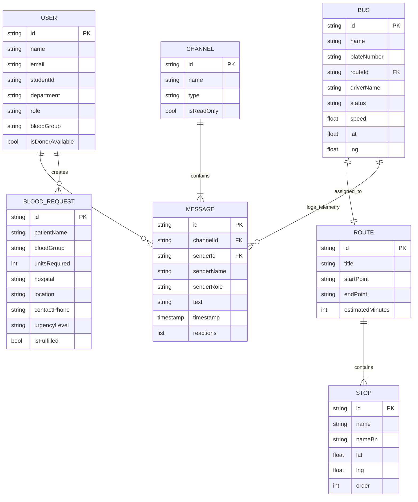

# 📊 Padma — Data Models & Schemas

> Detailed schema specification for all data entities, serialization structures, and domain models used in **Padma**.

---

## 1. Entity Relationship Diagram



---

## 2. Model Specifications

### 1. `BusRoute` (`lib/data/models/bus_route.dart`)
Represents an active university transit route.

```dart
class BusRoute {
  final String id;
  final String title;
  final String busNumber;
  final String driverName;
  final String currentStop;
  final String nextStop;
  final int etaMinutes;
  final double distanceProgress;
  final List<String> checkpoints;
}
```

### 2. `BusLocation` (`lib/features/live_bus/domain/models/bus_location.dart`)
Real-time GPS coordinate telemetry payload streamed from the bus transponder.

```dart
class BusLocation {
  final double latitude;
  final double longitude;
  final double speed;        // In km/h
  final double heading;      // 0 - 360 degrees
  final DateTime timestamp;
  final double accuracy;     // In meters
}
```

### 3. `ChatMessage` (`lib/data/models/chat_message.dart`)
Discord-style channel message payload.

```dart
class ChatMessage {
  final String id;
  final String senderName;
  final String senderRole;   // 'Student', 'Admin', 'Driver'
  final String text;
  final String time;
  final bool isMe;
  final List<String> reactions;
}
```

### 4. `EmergencyRequest` (`lib/data/models/emergency_request.dart`)
Verified emergency blood request entity.

```dart
class EmergencyRequest {
  final String id;
  final String bloodGroup;   // 'A+', 'B+', 'O+', 'AB-', etc.
  final String patientName;
  final String hospital;
  final String location;
  final int unitsNeeded;
  final String contactPhone;
  final String timeNeeded;
  final bool isUrgent;
  final int donorCount;
}
```

### 5. `NotificationItem` (`lib/data/models/notification_item.dart`)
Transit broadcast or emergency notification alert.

```dart
class NotificationItem {
  final String id;
  final String title;
  final String message;
  final String timeAgo;
  final String type;         // 'alert', 'announcement', 'blood'
  final bool isRead;
}
```

### 6. `UserProfile` (`lib/data/models/user_profile.dart`)
Student authentication and profile information.

```dart
class UserProfile {
  final String name;
  final String studentId;
  final String department;
  final String email;
  final String preferredRoute;
  final String bloodGroup;
  final bool isBloodDonor;
}
```
