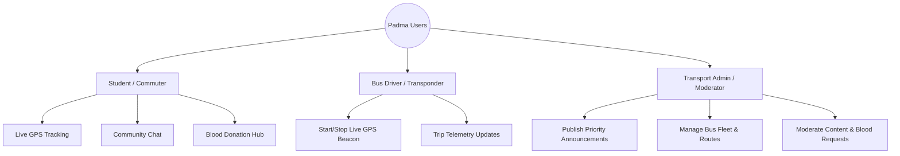

# 🚌 Padma — Project Overview & Vision

> **Padma (পদ্মা)**: The all-in-one real-time campus transit companion and community hub for the students, faculty, and administration of Ahsanullah University of Science and Technology (AUST).

---

## 1. Executive Summary

Navigating daily university commutes in metropolitan Dhaka presents significant logistical hurdles. Students at Ahsanullah University of Science and Technology (AUST) depend on the university's bus fleet daily, yet transit information has historically been fragmented across informal social media groups, uncoordinated phone calls, and word of mouth.

**Padma** solves this challenge by unifying:
1. **Live GPS Bus Tracking & ETA Predictions** on a real geographic vector map.
2. **Discord-Style Community Channels** for general discussions, per-route telemetry logs, and student interaction.
3. **Emergency Blood Donation & Request Hub** connecting campus donors with critical medical emergencies.
4. **Official Broadcasts & Admin Dashboards** for real-time announcements, delays, and schedule adjustments.
5. **Campus Utility Channels** including Lost & Found, Route Schedules, and Feedback systems.

---

## 2. Core Problem & Solution

| The Challenge | How Padma Solves It |
| :--- | :--- |
| **Unpredictable Bus Arrival Times**: Heavy Dhaka traffic leads to irregular schedules and students missing buses. | **Live Real-Time Map & Accurate Countdown**: Real-time GPS beacon updates, speed tracking, and minute-by-minute ETA calculations. |
| **Scattered Communication**: Delays and route changes are buried in informal chat groups. | **Official Announcement Channels**: Verified administration updates mirrored directly on the transit dashboard. |
| **Critical Medical Emergencies**: Urgent blood requests for students and families get lost in feed algorithms. | **Structured Emergency Requests**: Dedicated blood hub with group filters, hospital details, and instant "I Can Donate" matching. |
| **Crowded & Chaotic Transit Coordination**: Lack of dedicated spaces for specific bus route riders. | **Per-Bus Telemetry & Discussion**: Route-specific sub-channels where riders on the same bus communicate in real time. |

---

## 3. User Roles & Personas



### 1. Student / Commuter
- **Needs**: Accurate ETA, visual map tracking, notification before arrival, emergency blood coordination, campus chat.
- **Key Features**: Live vector map, route switching modal, general community chat, notification alerts, blood request creation/donation.

### 2. Transport Office / Admin
- **Needs**: Disseminate official announcements, notify riders of breakdowns or diversions, oversee fleet health.
- **Key Features**: Announcement broadcasting, emergency verification, route and fleet schedule management.

### 3. Bus Driver / Fleet Transponder
- **Needs**: Seamless background location sharing without complex UI interactions.
- **Key Features**: One-touch broadcast session toggle, automated telemetry streaming, status reporting (On Time, Delayed, Breakdown).

---

## 4. Key Highlights & Synergy

```
┌────────────────────────────────────────────────────────┐
│                   PADMA APPLICATION                    │
├──────────────────────────┬─────────────────────────────┤
│   TRANSIT & TELEMETRY    │    COMMUNITY & EMERGENCY    │
├──────────────────────────┼─────────────────────────────┤
│ • MapLibre / OpenStreetMap│ • Discord-style Drawer      │
│ • Live GPS Interpolation │ • #general Community Chat   │
│ • Checkpoint Progression │ • Per-Bus Sub-channels      │
│ • Dynamic ETA Countdown  │ • Verified Blood Requests   │
│ • Route Switcher Modal   │ • Lost & Found Directory    │
└──────────────────────────┴─────────────────────────────┘
```

- **Seamless Transit to Community Integration**: From the active bus tracker card, a single tap on the **Message** button routes users directly to the campus `#general` discussion channel.
- **Bilingual Accessibility**: Full English and native Bengali (বাংলা) localization across all screens and notifications.
- **Modern Dark Aesthetic**: Deep oceanic teals, charcoal surfaces, and high-visibility transit amber accents inspired by top developer tools and community platforms.

---

## 5. Technology Foundation

- **Framework**: Flutter 3.x with Dart 3.x (Clean MVVM Architecture).
- **Mapping & Geodata**: `flutter_map` with CartoDB Dark Matter vector tile rasterization & OpenStreetMap data.
- **State Management**: Reactive `Provider` with specialized ViewModels.
- **Local Persistence & Cache**: Fast in-memory repositories with ready-to-plug Firestore/REST APIs.
- **Localization**: Native Flutter `flutter_localizations` with ARB dictionary definitions (`app_en.arb`, `app_bn.arb`).

---

## 6. Product Roadmap

### Phase 1: MVP Core (Current)
- [x] Geographic live map with smooth beacon interpolation and simulated GPS telemetry.
- [x] Route switcher supporting Mirpur, Uttara, and Motijheel lines.
- [x] Discord-style sliding channel drawer and `#general` chat.
- [x] Emergency blood request feed with blood group filtering.
- [x] User profile management with blood donor availability toggle.
- [x] Bilingual English / Bangla localization.

### Phase 2: Live Backend & Hardware Integration
- [ ] Real-time WebSocket / Firestore backend connectivity.
- [ ] Hardware GPS OBD-II tracker ingestion pipeline.
- [ ] Push notifications via Firebase Cloud Messaging (FCM).
- [ ] Automated geofencing arrival alerts ("Bus is 500m from your stop").

### Phase 3: Smart Transit Intelligence
- [ ] Machine learning traffic-adjusted historical ETA prediction.
- [ ] Crowd-sourced bus occupancy indicators (Low / Medium / Full).
- [ ] Digital QR-based student bus boarding pass.
