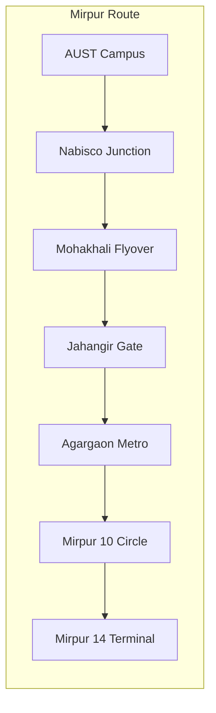
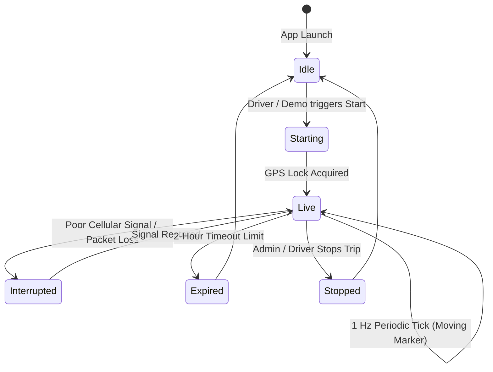

# 🛰️ Padma — Real-Time Telemetry & Maps Engine

> Technical guide to Padma's live geographic mapping engine, GPS waypoint interpolation, simulation controller, and hardware transponder integration.

---

## 1. Map Engine Architecture

Padma employs `flutter_map` backed by high-performance **CartoDB Dark Matter** raster tiles over **OpenStreetMap** geodata.

```
┌────────────────────────────────────────────────────────┐
│               PadmaLiveMapWidget (Stack)               │
├────────────────────────────────────────────────────────┤
│ 1. TileLayer (CartoDB Dark Matter @2x)                 │
│ 2. PolylineLayer (Static Route Waypoints in Teal)      │
│ 3. MarkerLayer (Stops & Checkpoints with Radial Halo)  │
│ 4. MarkerLayer (Moving Bus GPS Beacon + Heading Arrow) │
│ 5. HUD Overlay (Speedometer, Recenter, Demo FAB)       │
└────────────────────────────────────────────────────────┘
```

### Tile Server Configuration (`lib/core/config/map_config.dart`):
- **Base Tile URL**: `https://basemaps.cartocdn.com/rastertiles/dark_all/{z}/{x}/{y}@2x.png`
- **Default Center**: AUST Campus (`23.7690° N, 90.4073° E`, Tejgaon, Dhaka)
- **Default Zoom**: `14.5` (City transit scale)
- **Bus Focus Zoom**: `16.0` (Vehicle vicinity scale)

---

## 2. Waypoint Progression & Routes

Padma includes pre-mapped high-fidelity Dhaka transit routes:



### Route Coordinates (`MockDeviceLocationService.demoWaypoints`):
- High-density polyline coordinates sampled at 50-meter intervals along Dhaka roadways.
- Built-in distance calculation using the Haversine formula to compute instantaneous distance-to-stop and ETA countdowns.

---

## 3. Simulation & Live Telemetry States

The `LiveBusViewModel` manages the state machine for the bus beacon:



### Telemetry State Properties:
- `isLive`: Boolean indicating active GPS transmission.
- `currentLocation`: `BusLocation` (lat, lng, speed, heading, timestamp).
- `remainingSession`: Active countdown for safety broadcast timeout.
- `lastUpdated`: Timestamp of the latest received GPS packet.

---

## 4. Hardware & Production GPS Ingestion

For production deployment with real vehicle tracking, Padma provides ready-to-wire interfaces:

1. **Driver Mobile Transponder**:
   - `geolocator` or `background_locator_2` streams location packets from the driver's smartphone directly to Firebase Realtime Database / WebSocket server.
2. **OBD-II / Standalone GPS Trackers**:
   - Vehicle-mounted GPS hardware (e.g., Teltonika, Concox) communicates via TCP/UDP with a cloud ingestion server (Traccar / Node.js telemetry gateway).
   - Ingestion server parses NMEA 0183 / GPRMC sentences and pushes sanitized updates to client subscriptions.
